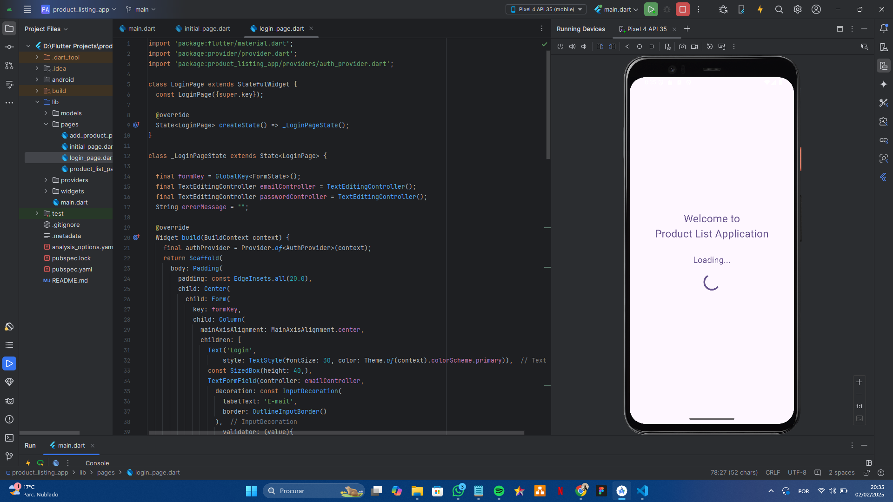
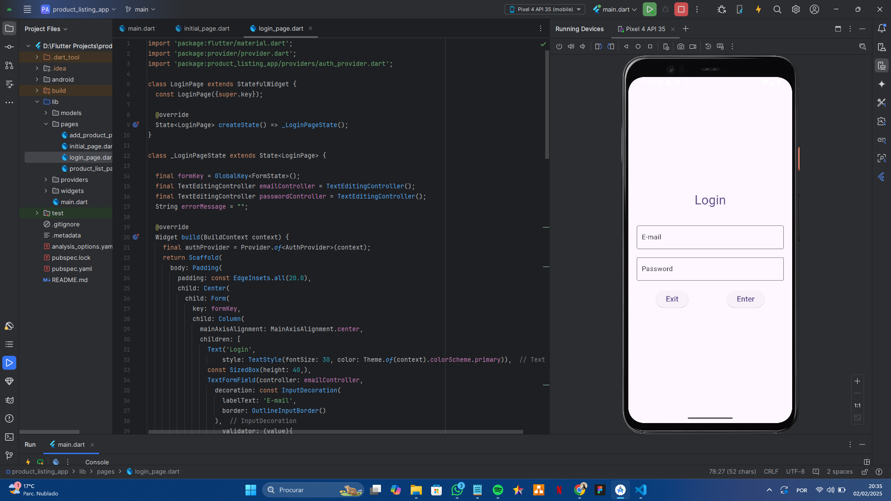
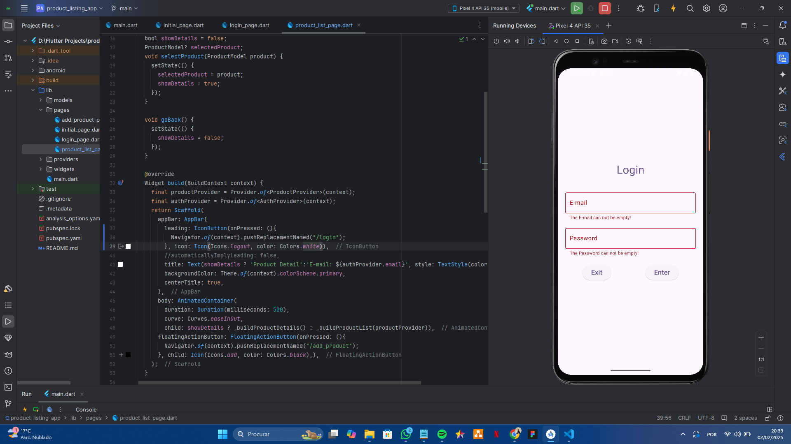
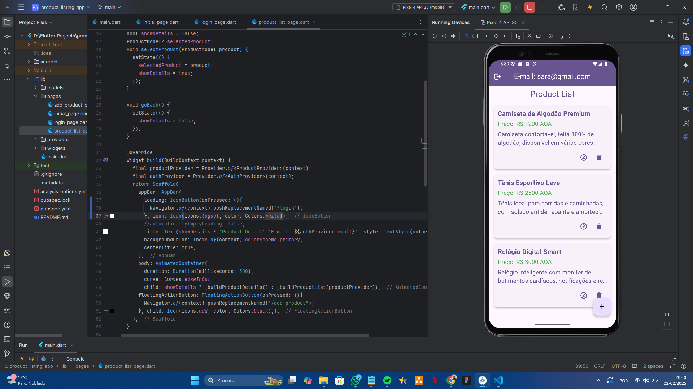
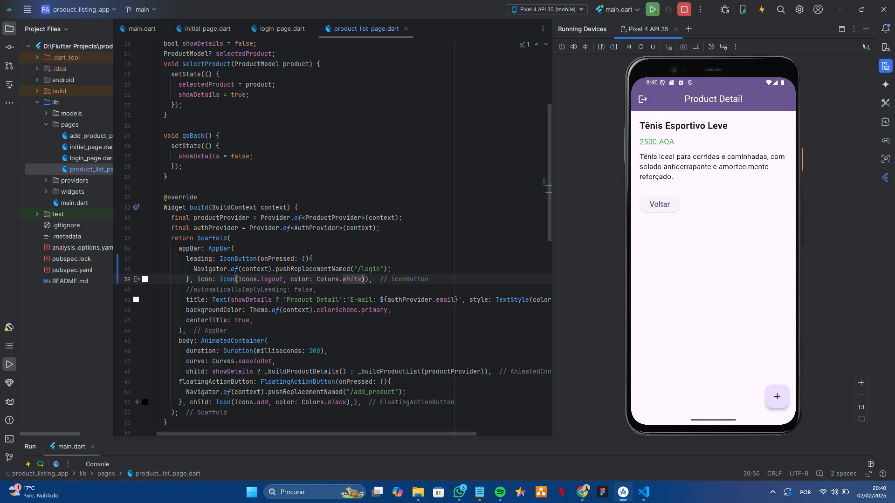
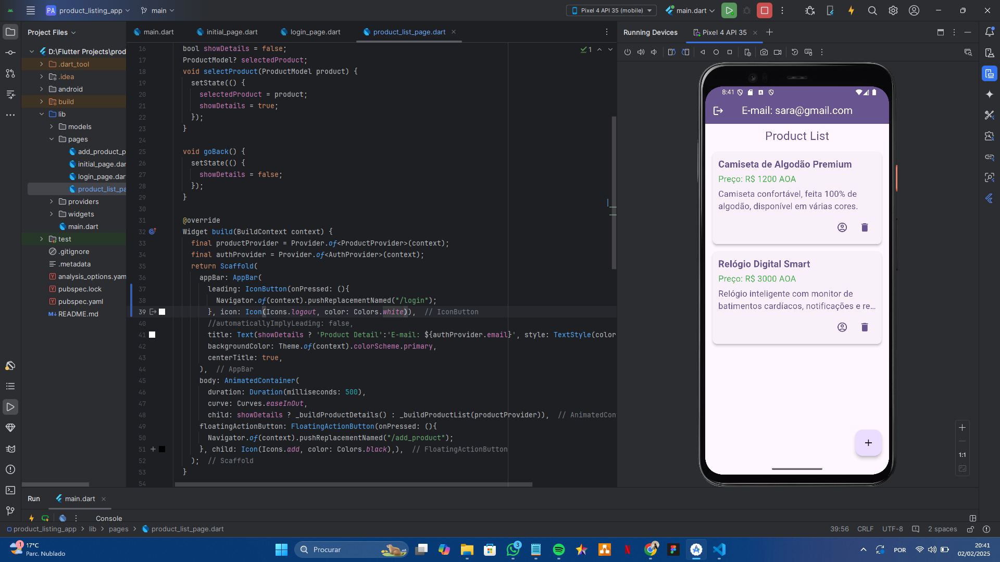
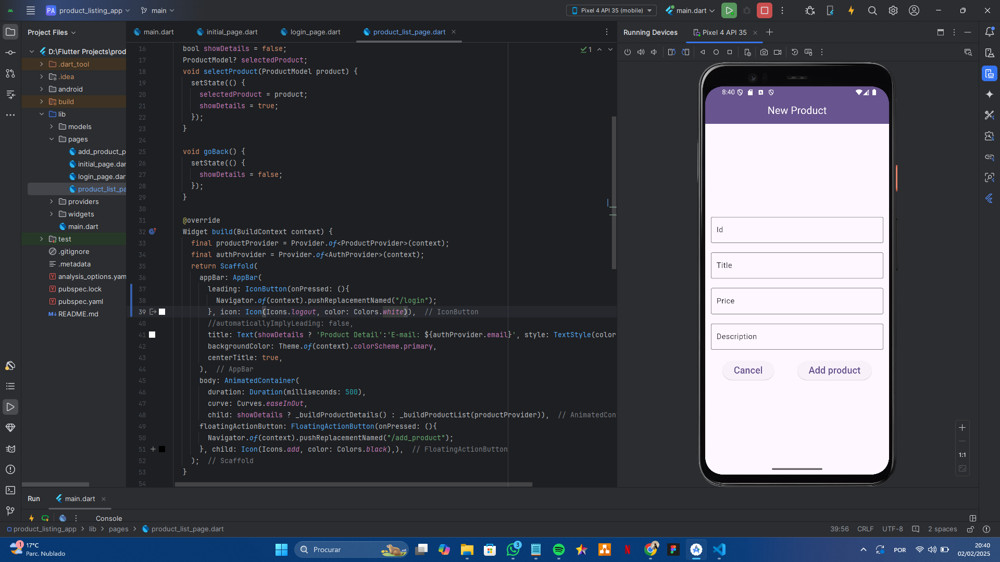

# product_listing_app

A new Flutter project.
Challenge: Listing App and Product Details

## Description

To solve this challenge, I created a simple application in Flutter, with the main pages (login, product list and product details).

With this, I learned how to work with named routes, simple state management with a provider and all the widgets that were necessary to analyze the pages and add the necessary functionality.

At this stage, I didn't focus on making the screens super pretty but on understanding how flutter works, it was very good practice, even though there are few screens, practice makes perfect. 

## APP PrintScreen

#### Inicial Loading Page

#### Login Page

#### Login Page Validate Action

#### Product List Page

#### Product 2 - Detail Page

#### Product Listing Page, when i remove second Product Item in the list

#### Product 3 - Detail Page

#### Add New Product Page

Thanks for visiting, don't forget to leave a star here in the repository!

 
  
   
   
